GUI workflow
==============

Welcome to Polemarch GUI
------------------------

In this section of our documentation we will tell you about Polemarch GUI's opportunities.

Let's begin with Dashboard page:

As you can see, Polemarch GUI provides user with 2 menus:

* the first one is located in the left sidebar and it is aimed
  to provide user with navigation between main system objects, like projects, inventories, history records and ect.

* the second one is located in the top right conner of browser window and it is aimed
  to navigate user to API section, to user's page and to logout page.

Also there are some widgets on content block of Dashboard page. User can customize Dashboard page as he wish.
For example, user can change widgets' position, hide some widgets or collapse them.

To change widgets' position user should click on 'lock' button. After this button has been clicked,
user is able to change widgets' position by Drag and Drop.

To collapse or to hide/show some widgets user should click on 'cogwheel' button. After this button has been clicked,
Polemarch opens modal window, where user can activate or collapse some widgets.

Before you start
----------------

Before you can do any job with Polemarch you should create at least one
inventory with your servers enumeration(groups and hosts) and at least one project, because all
Polemarch's functions are linked to the project.

Inventories
-----------

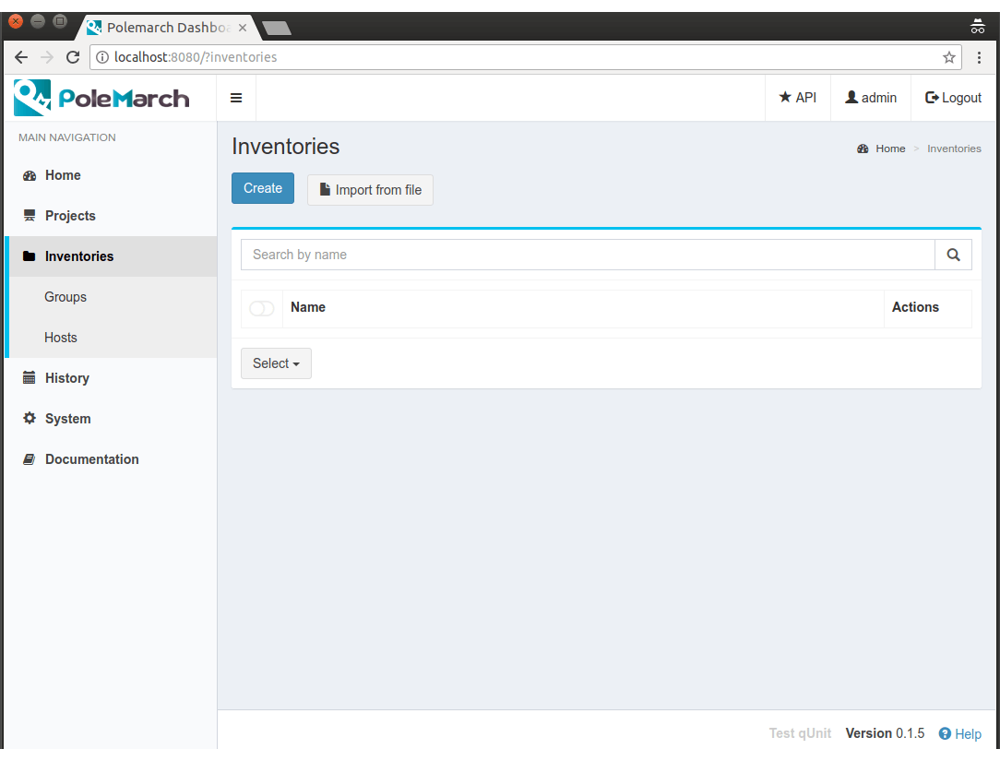

There are 2 ways of inventory's creation:

* the first one is to create inventory manually. To do it user should click on "Create" button.

* the second one is to import inventory from text file. To do it user should click on "Import from file" button.

By inventory's creation, in this case, we understand creation of inventory, which includes at least one group,
which, in it's turn, includes at least one host. In other words, beside inventory user should create host and group.

To understand it better let's look at next images, which will explain you how to create inventory manually.
Here you can see the form for manual creation of inventory.

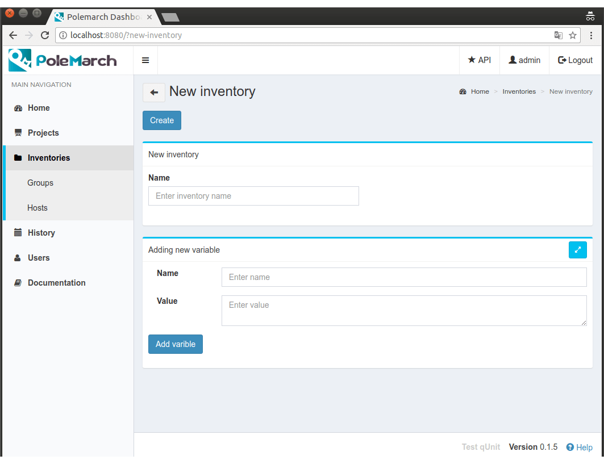

As you can see, this form is rather simple. There are only 2 sections with several fields to input.

Section "New inventory":

* **name** - name of your inventory.

* **notes** - not required field for some user’s notes, for example,
  for what purpose this inventory was created or something like this.

Section "Adding new variable":

* **name** - name of ansible variable. This field has autocomplete, so you can just start typing
  the variable name and Polemarch will suggest you appropriate name values.

* **value** - value of ansible variable.

After inventory creation you will see the next page:

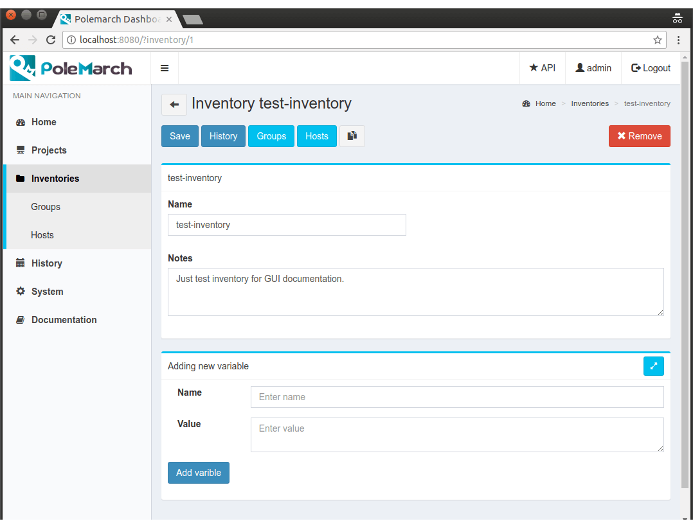

There are some new buttons here:

* **save** - this button saves all changes you have made on this page.
* **history** - this button opens history list of inventory executions.
* **groups** - this button opens subgroups list of this inventory.
* **hosts** - this button opens subhosts list of this inventory.

Let's look how you can create a group for this inventory.
To do it, let's click on 'Groups' button.

Groups
------

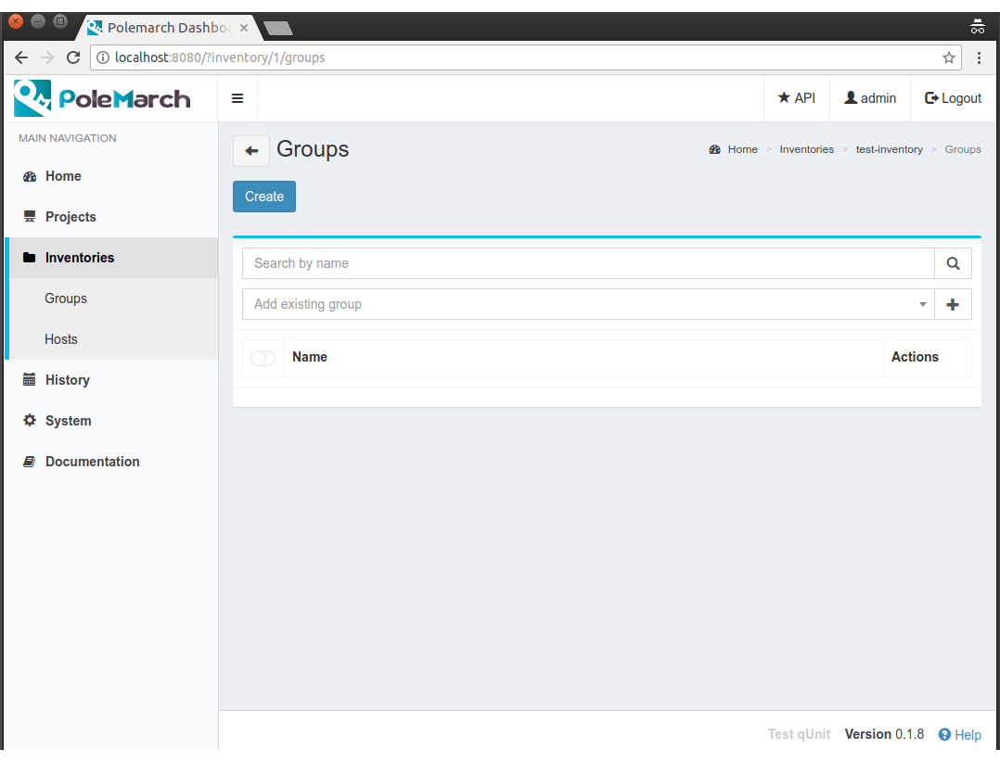

As you can see, on this page you can either create new group or just add existing one.

Let's click on 'Create' button.

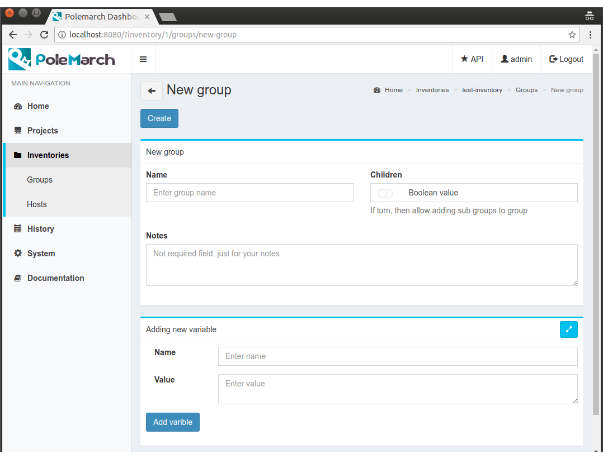

Section "New group":

* **name** - name of your group.

* **children** - if this field is true, group can consist of other croups only.
  Otherwise, this group can consist of hosts only.

* **notes** - not required field for some user’s notes, for example,
  for what purpose this group was created or something like this.

Section "Adding new variable":

* **name** - name of ansible variable. This field has autocomplete, so you can just start typing
  the variable name and Polemarch will suggest you appropriate name values.

* **value** - value of ansible variable.

After group creation you will see the next page:

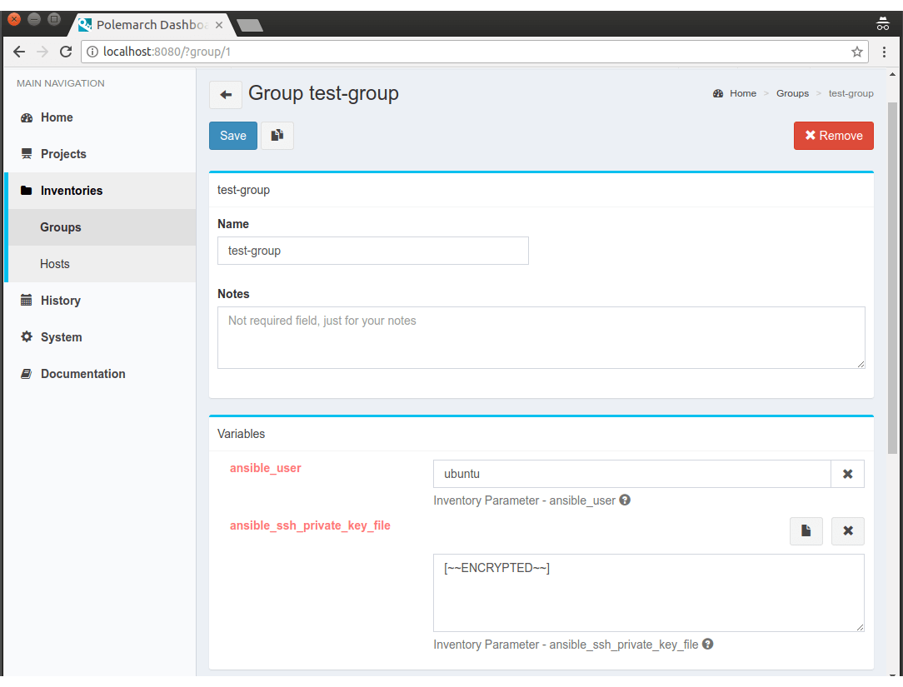
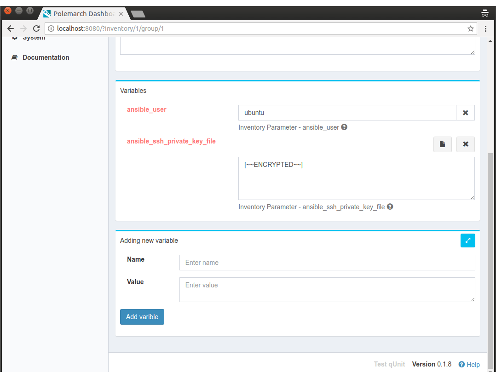

As you can see, there are 2 new buttons here:

* **hosts** - this button opens subhosts list of this group.
* **remove from parent group** - this button removes our new host from current
  group's hosts  list, but does not delete it from system.

Also new "Variables" section has appeared.
"Variables" section has a list of variables that user have chosen during group creation.

Let's look how you can create a host for this group.

Hosts
-----

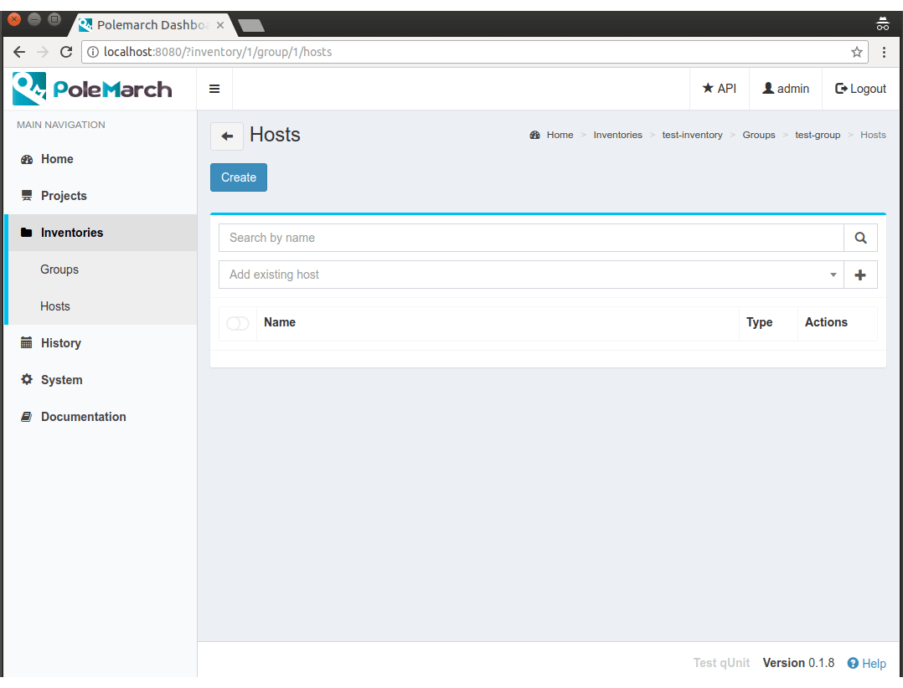

As you can see, on this page you can either create new host or just add existing one.

Let's click on 'Create' button.

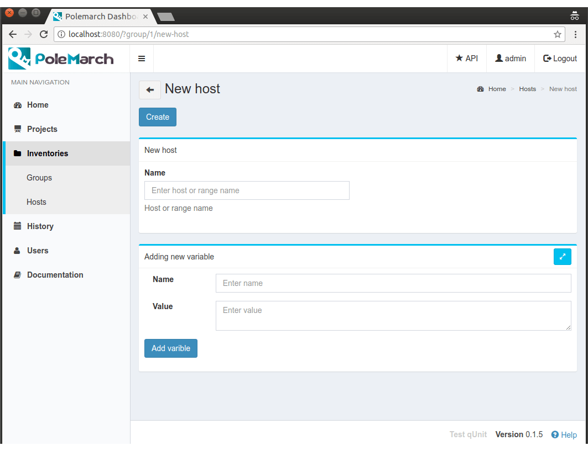

Section "New host":

* **name** - name of your host.
  Name can be either human-readable(example.com) or hostname/IP (192.168.0.12) or range of them(19[2:7].168.0.12).

* **notes** - not required field for some user’s notes, for example,
  for what purpose this host was created or something like this.

Section "Adding new variable":

* **name** - name of ansible variable. This field has autocomplete, so you can just start typing
  the variable name and Polemarch will suggest you appropriate name values.

* **value** - value of ansible variable.

After host creation you will see the next page:

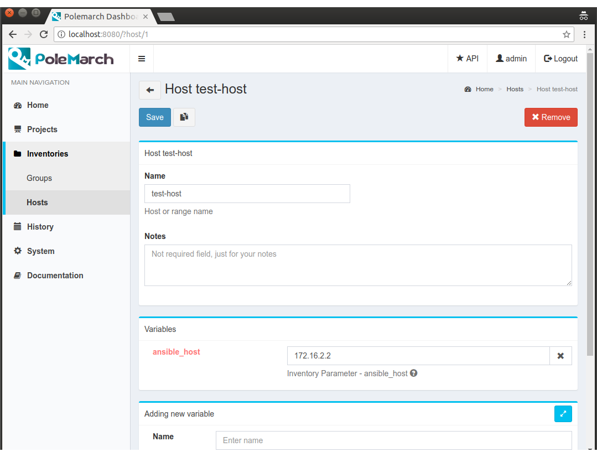

As you can see, new button 'Remove from parent group' has appeared.
This button removes our new host from current group's hosts  list, but does not
delete it from system.

Also new "Variables" section has appeared and it has a list of variables that user have chosen during host creation.

Projects
--------

Futher to start your work with Polemarch you should create project.

There are 3 project types in Polemarch:

* GIT - Polemarch can sync with your git project.

* TAR - If you don't have git repository, you can upload tar archive with project files
  from any http url.

* MANUAL - Empty project. This kind of project will be appropriate for you,
  if you want run only modules without any playbooks or something. Polemarch will
  create folder for your project files in `projects_dir` (you can specify it
  in settings) named as project id (you can see at URL), where you
  place manually your project files (like playbooks or something).

Let's look at the example of GIT project's creation:

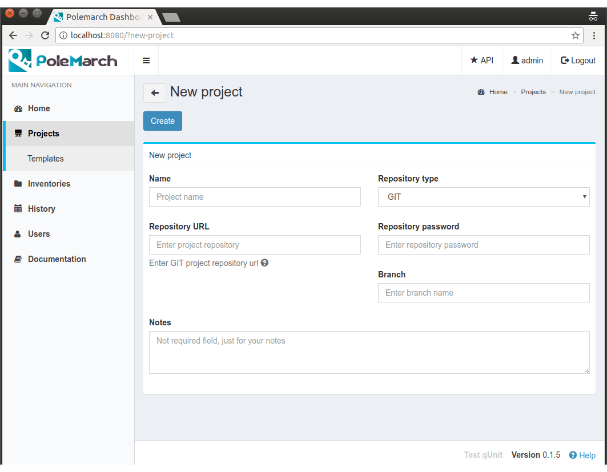

As you can see, the form of new GIT project creation consist of 5 fields:

* **name** - name of your project.

* **repository type**  - type of project repository (GIT, TAR, MANUAL).

* **repository URL** - URL to your repository.

* **repository password** - repository password if it exist.

* **branch** - branch of your GIT project, to what your Polemarch project will be synced.
  If you stay it empty, Polemarch will sync to "master" branch.

* **update before execution** - if true, project will be updated before each task
  execution from this project.

* **notes** - not required field for some user’s notes, for example,
  for what purpose this project was created or something like this.

After project creation you will the next page:

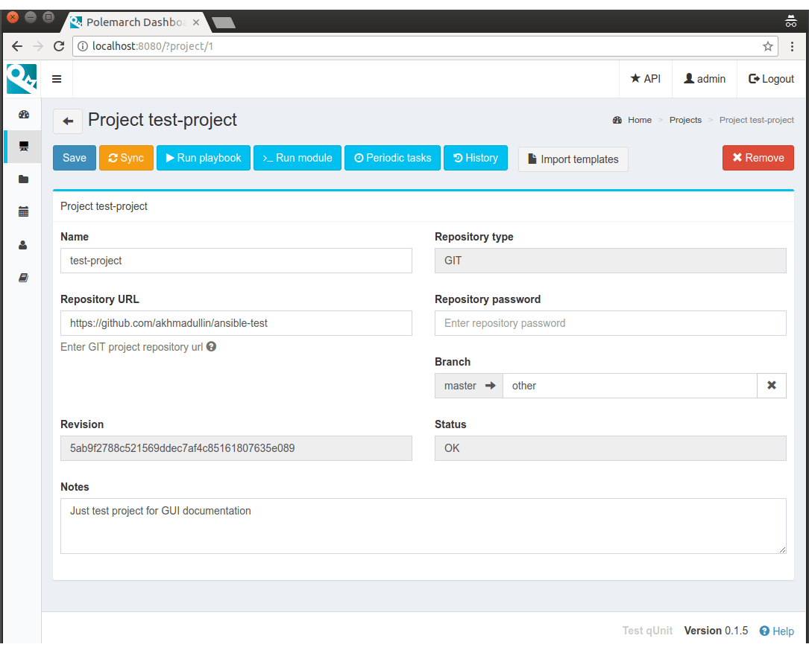
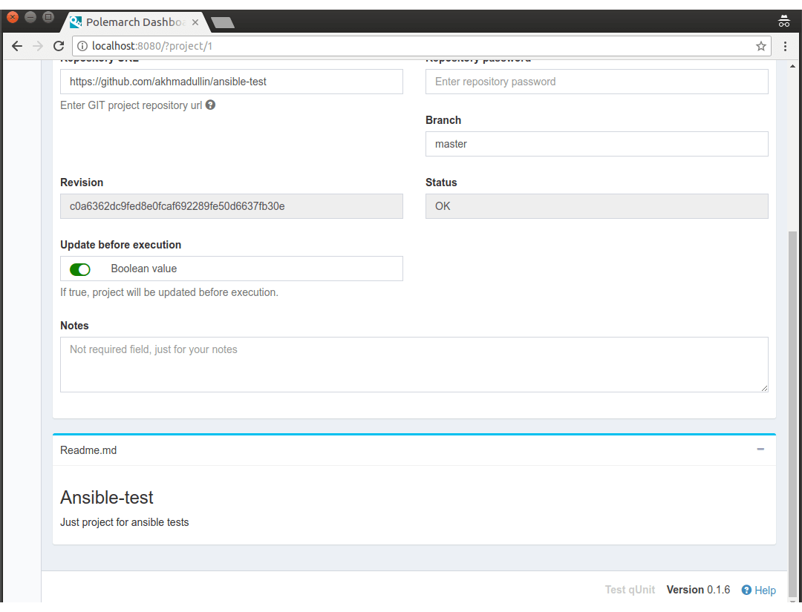

As you can see at image above for GIT project
it is possible to choose a branch to what user want to sync. In this example user will sync
his GIT project from 'master' branch to 'other' branch during next synchronization. 'Arrow' icon in the branch input field
shows us, that project will be sync from one branch to another. If there is no 'arrow' icon, it means,
that next time project will be sync to the same branch as you can see it in 'Branch' input field.

Also there are 2 new fields:

* **revision** - GIT project revision.

* **status** - Polemarch project status.
  Possible values are: NEW - newly created project,
  WAIT_SYNC - repository synchronization has been scheduled, but has not started to perform yet,
  SYNC - synchronization is in progress,
  ERROR - synchronization failed,
  OK - project is synchronized.

There is new section on this page:

* **reame.md** - if project has “readme.md” or “readme.rst” file in it’s project directory,
  Polemarch will add content of this file to this section.

Also there are several buttons on this page:

* **save** - this button saves all changes you have made on this page.

* **sync** - this button syncs your Polemarch project with GIT repository.

* **run playbook** - this button opens a "Run plabook" page.

* **run module** - this button opens a "Run module" page.

* **periodic tasks** - this button opens a page with list of periodic tasks of this project.

* **history** - this button opens a page with list of history records of this project.

* **import templates** - this button imports a text file with task/module template for this project from your computer.

* **remove** - this button deletes this project.

If you update something in your GIT repository, don't forget to run sync in
Polemarch for pulling your changes.

After your project's status has changed into "OK" you can confidently start working with Polemarch.

Execution of modules
--------------------

Ok, we made all preparations and ready to do some real work. Let's start by
executing some command on your servers:

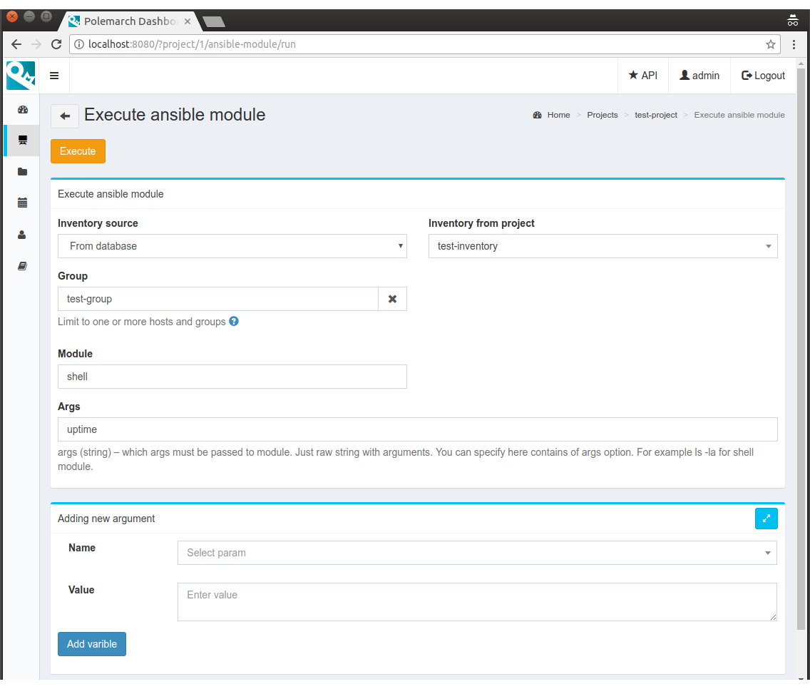

Here you can see 2 sections: "Execute ansible module" and "Adding new argument".

"Execute ansible module" consist of next fields:

* **inventory source** - source of inventory. It can be either "From database" or "From file in project dir".

* **inventory from project / inventory file** - name of inventory.

* **group** - name of group to which this module will be executed.

* **module** - name of ansible module. This field has autocomplete, so you can just start typing
  the ansible module name and Polemarch will suggest you appropriate name values.

* **args** - arguments for ansible module.

Section "Adding new argument":

* **name** - name of ansible variable.

* **value** - value of ansible variable.

After you completed all necessary fields you should click on "Execute" button to run this ansible module.
After this you will see the next page:

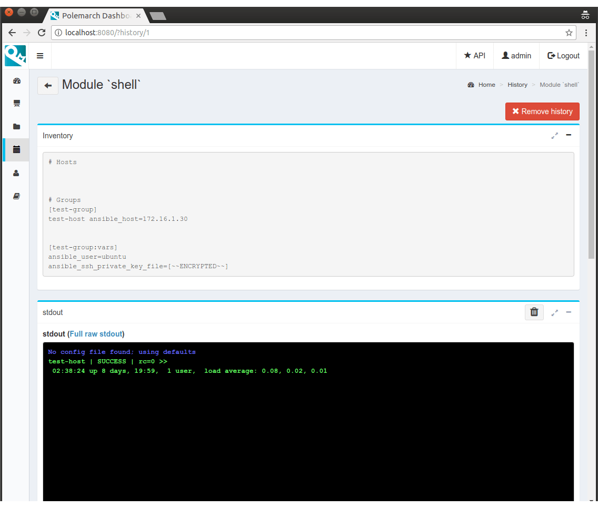
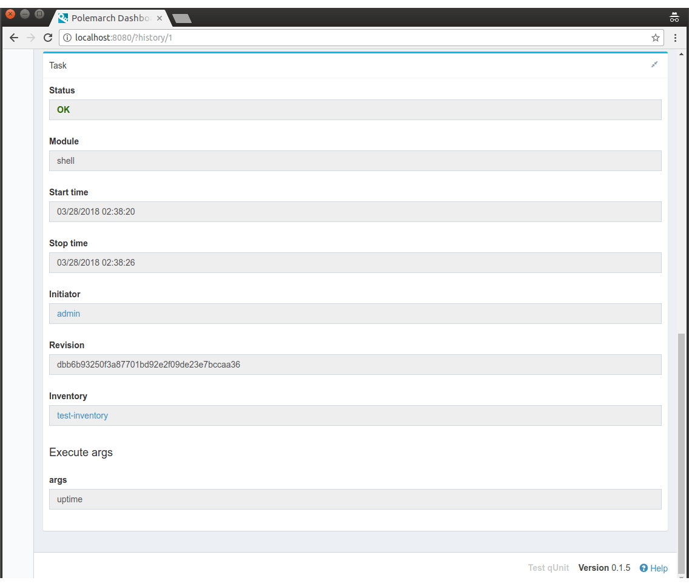

As you can see there are 3 sections on this page: "Inventory", "stdout", "Task".

"Inventory" section includes  ansible inventory in text format.

"stdout" section includes  what ansible has written to stdout and stderr during execution.
With "Clear" button you can delete this output.

"Task" sections consist of next fields:

* **status** - status of task. It indicates different results of execution and can be
  DELAY (scheduled for run), OK (successful run), INTERRUPTED (interrupted by user), RUN (currently running),
  OFFLINE (can’t connect to node), ERROR (failure).

* **module** - name of executed module.

* **start time** - time, when task execution was started.

* **stop time** - time, when task execution was finished.

* **execution time** - amount of time the execution took.

* **initiator** - name of object, who executed this task.

* **executor** - name of user, who executed this task.

* **revision** - project revision.

* **inventory** - name of inventory.

* **args** - list of args, which were used during task execution.

Execution of playbooks
----------------------

Also you can run any of playbooks in your project.

Polemarch will scan project dir root for any .yml file and provide possibility
to run them. So place available playbook targets at root of your GIT repository
or tar-archive or folder with your project files.

Be aware that your project must have "OK" status, because your
playbooks won't work until Polemarch done synchronization with repository.
If you made everything right, project playbooks will be shown in suggestions
in playbook execution page.

Let's look at the example of running some playbook, which Polemarch imported from GIT repository
of our project:

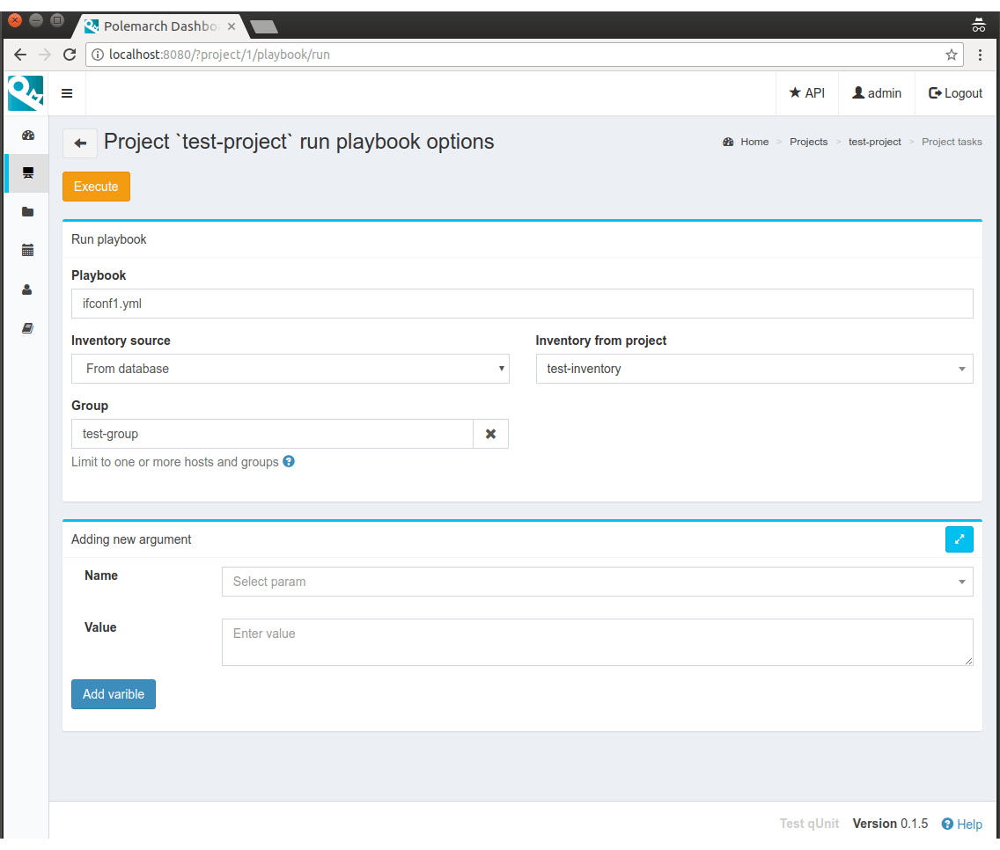

Here you can see 2 sections: "Run playbook" and "Adding new argument".

"Run playbook" consist of next fields:

* **playbook** - name of playbook. This field has autocomplete with playbook names from your GIT/TAR/MANUAL project.

* **inventory source** - source of inventory. It can be either "From database" or "From file in project dir".

* **inventory from project / inventory file** - name of inventory.

* **group** - name of group to which this module will be executed.

Section "Adding new argument":

* **name** - name of ansible variable.

* **value** - value of ansible variable.

After you completed all necessary fields you should click on "Execute" button to run this playbook.
After this you will see the next page:

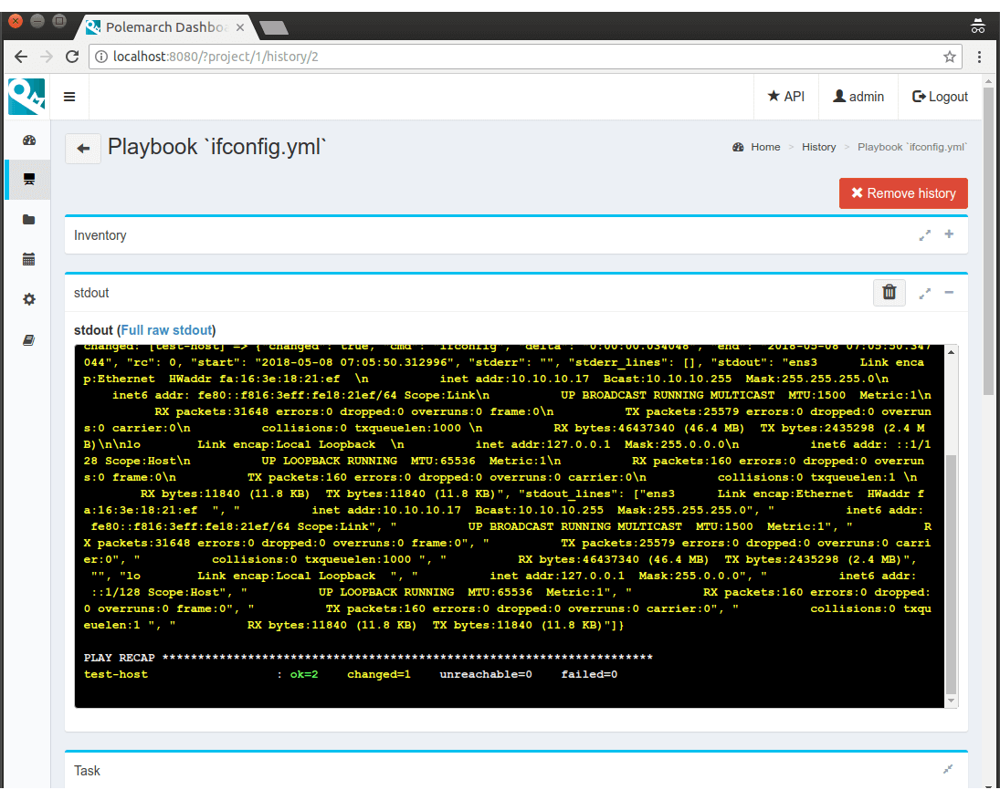
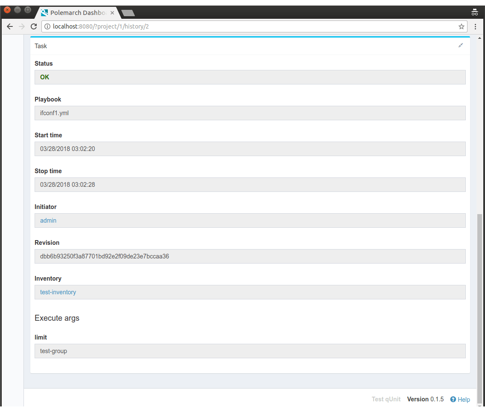

As you can see there are 3 sections on this page: "Inventory", "stdout", "Task".

"Inventory" section includes  ansible inventory in text format.

"stdout" section includes  what ansible has written to stdout and stderr during execution.
With "Clear" button you can delete this output.

"Task" sections consist of next fields:

* **status** - status of task. It indicates different results of execution and can be
  DELAY (scheduled for run), OK (successful run), INTERRUPTED (interrupted by user), RUN (currently running),
  OFFLINE (can’t connect to node), ERROR (failure).

* **playbook** - name of executed playbook.

* **start time** - time, when task execution was started.

* **stop time** - time, when task execution was finished.

* **execution time** - amount of time the execution took.

* **initiator** - name of object, who executed this task.

* **executor** - name of user, who executed this task.

* **revision** - project revision.

* **inventory** - name of inventory.

* **args** - list of args, which were used during task execution.

Templates
---------

If you have many arguments, which you pass to Ansible at every task run (like
extra-vars, forks number and so on), you can create template for such action
to minimize hand work. Polemarch provides user with 2 kinds of templates:
task template(template for playbook execution) and module template(template for module execution).
Both of this template kinds are similar, that's why we will look at the example of module template creation only.

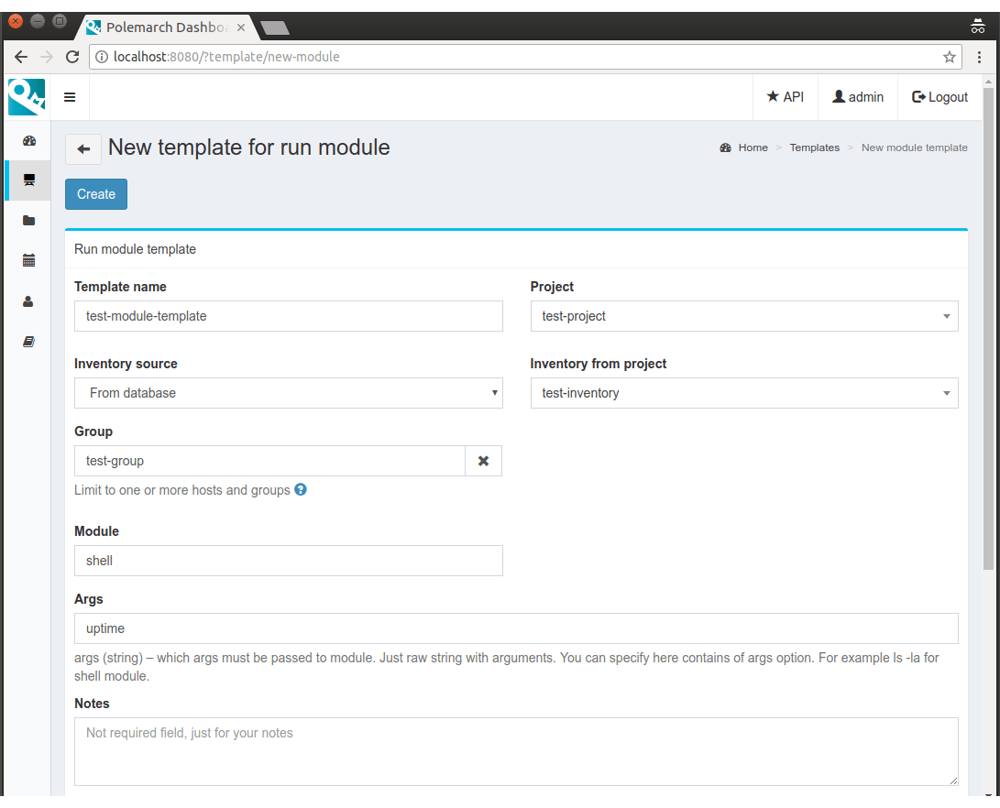

This page has 2 sections: "Run module template" and "Adding new argument".

"Run module template" section consist of next fields:

* **template name** - name of template.

* **project** - name of project, for which this template will be available.

* **inventory source** - source of inventory. It can be either "From database" or "From file in project dir".

* **inventory from project / inventory file** - name of inventory.

* **group** - name of group to which this module will be executed.

* **module** - name of ansible module. This field has autocomplete, so you can just start typing
  the ansible module name and Polemarch will suggest you appropriate name values.

* **args** - arguments for ansible module.

* **notes** - not required field for some user’s notes, for example,
  for what purpose this template was created or something like this.

Section "Adding new argument":

* **name** - name of ansible variable.

* **value** - value of ansible variable.

After you completed all necessary fields you should click on "Create" button to save this template.
After this you will see the next page:

.. image:: gui_png/module-template-page.png

As you can see, this page has the same sections as the previous page.

But also there are some new buttons here:

* **save** - this button saves all changes you have made on this page.

* **save and execute** - this button saves all changes you have made on this page and executes this template.

* **options** - this button opens the page with this template options list.

* **periodic tasks** - this button opens the page with the list of periodic tasks based on this template.

* **history** - this button opens history list of template executions.

* **copy** - this button creates a copy of this template.

* **remove** - this button deletes this template.

Options
-------

Sometimes your need to keep some similar templates, which are different by only several parameters.
In this case template options will be extremly useful for you. In every template you can create
a lot of options which can modify this template by some parameters. Let's look at the example:

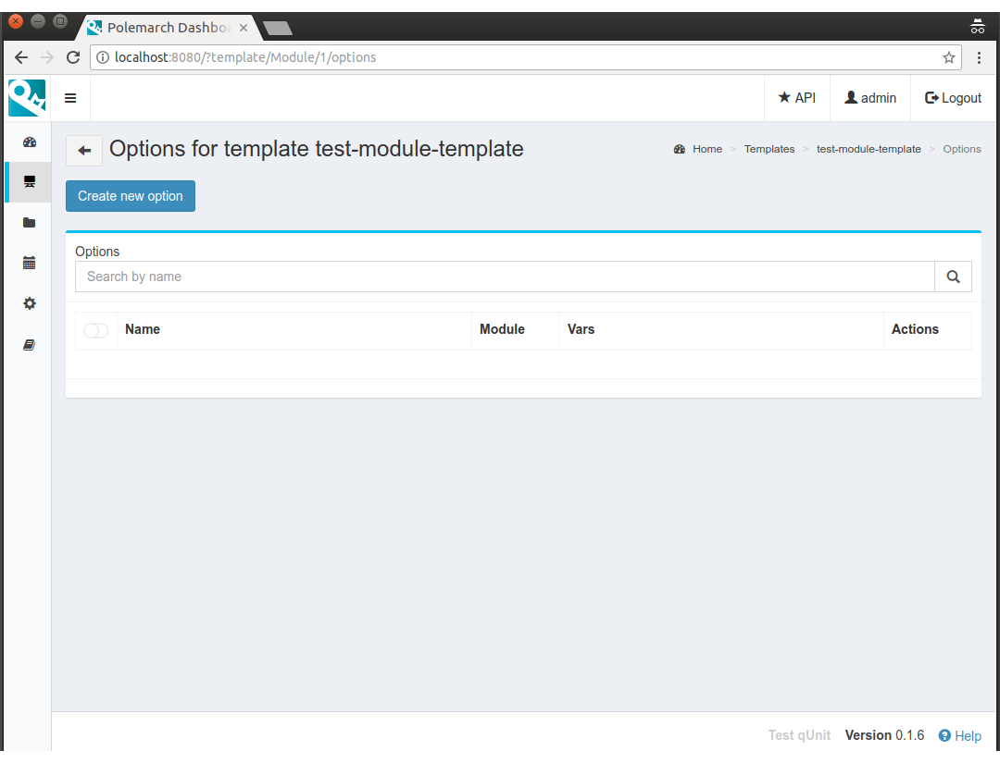

As you can see, now there are no options for this template. Let's create the first one.

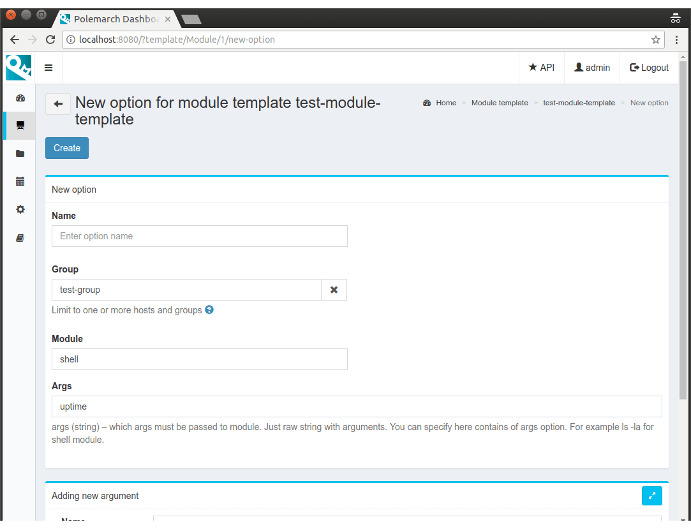

As you can see there are 2 section on this page: "New option" and "Adding new argument".

"New option" section consist of next fields:

* **name** - name of option.

* **group** - name of group to which this template will be executed, if this option be selected for execution.

* **module** - name of ansible module  which will be executed, if this option be selected for execution.
  This field has autocomplete, so you can just start typing
  the ansible module name and Polemarch will suggest you appropriate name values.

* **args** - ansible module arguments, which will be used, if this option be selected for execution.

Section "Adding new argument":

* **name** - name of ansible variable.

* **value** - value of ansible variable.

After you completed all necessary fields you should click on "Create" button to save this template option.
After this you will see the next page:

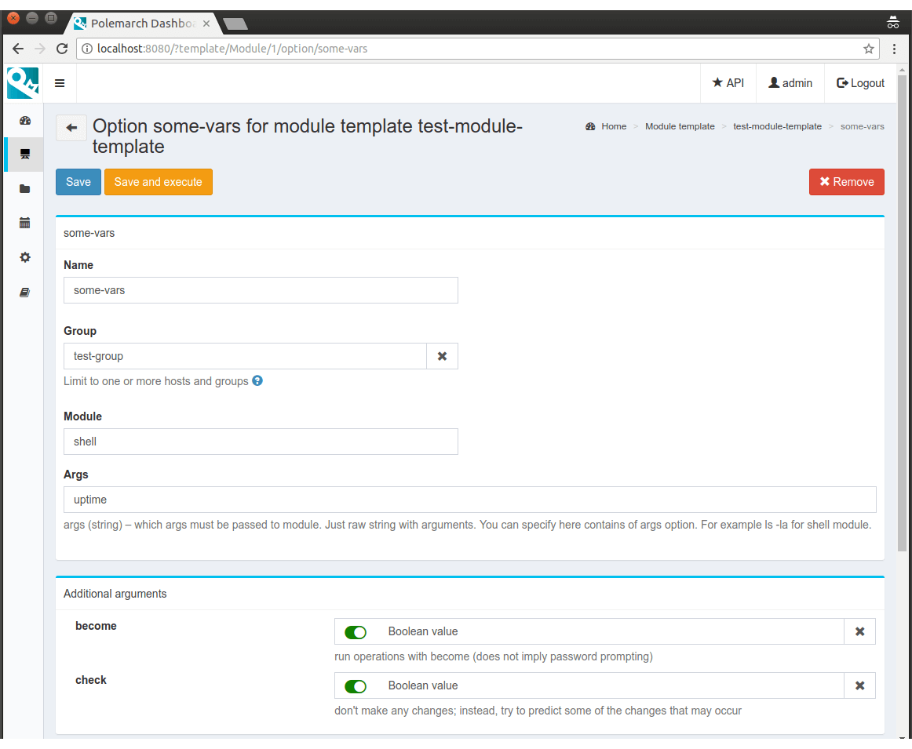

There is new section "Additional arguments", that includes list of arguments, which will be added
to template during execution.

Buttons on this page:

* **save** - this button saves all changes you have made on this page.

* **save and execute** - this button saves all changes you have made on this page and executes template with this option.

* **remove** - this button deletes this template option.

Also you can backup/share your templates using export mechanism:

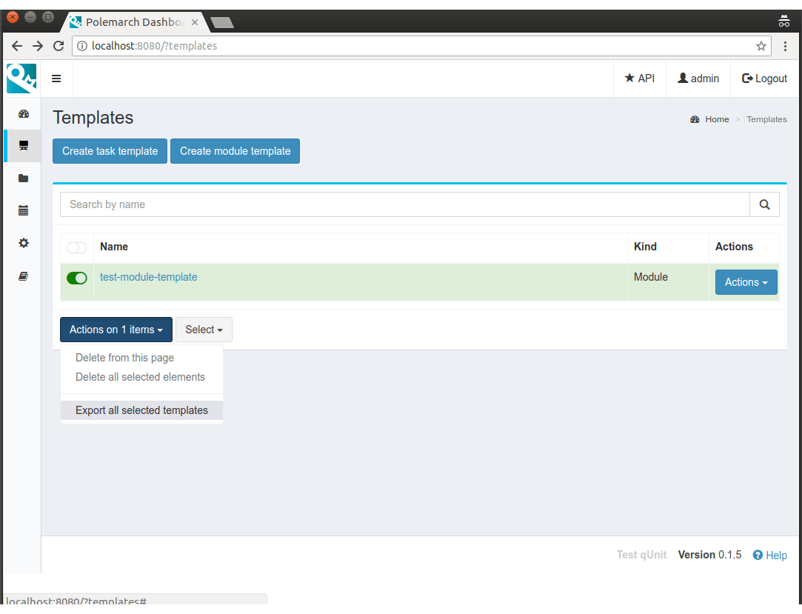

Periodic tasks
--------------

If you want to run some actions by schedule without any control from
you, it is possible with Polemarch. You can create periodic tasks, which runs
every X seconds (interval based):

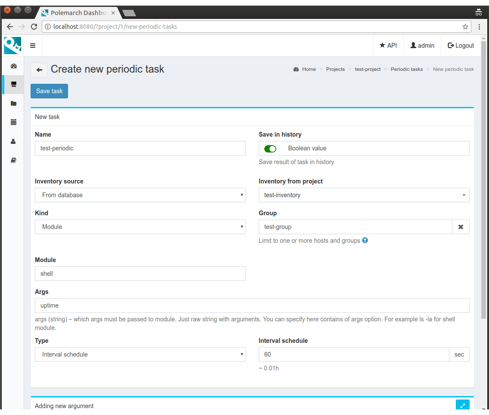

As you can see there are 2 sections on this page: "New task" and "Adding new argument".

"New task" section consist of next fields:

* **name** - name of periodic task.

* **save in history** - if value is true, the fact of task execution will be saved in history records.
  Otherwise, no history records about this periodic task execution will be saved.

* **kind** - kind of task: module or playbook.

* **playbook** - name of playbook. This field is available for kind=playbook only.

* **module** - name of ansible module. This field has autocomplete, so you can just start typing
  the ansible module name and Polemarch will suggest you appropriate name values.
  This field is available for kind=module only.

* **template from project** - name of template from this project. This field has autocomplete, so you can just start typing
  the template name and Polemarch will suggest you appropriate name values. Also it is possible to choose template with some option.
  Options' name will be shown in square brackets, for example, "template_name [template_option_name]".
  This field is available for kind=template only.

* **group** - name of group to which this periodic task will be executed.

* **args** - arguments for ansible module. This field is available for kind=module only.

* **inventory source** - source of inventory. It can be either "From database" or "From file in project dir".

* **inventory from project / inventory file** - name of inventory.

* **type** - type of schedule. It can be either "Interval schedule" or "Cron style schedule".

* **interval schedule / cron style schedule** - value for schedule.

* **notes** - not required field for some user’s notes, for example,
  for what purpose this periodic task was created or something like this.

Section "Adding new argument":

* **name** - name of ansible variable.

* **value** - value of ansible variable.

After you completed all necessary fields you should click on "Save task" button to save this periodic task.
After this you will see the next page:

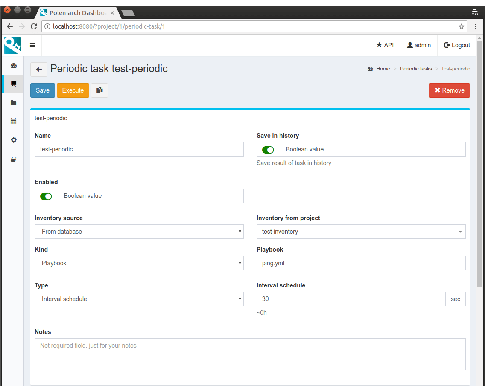

This page has the same sections as the previous one, but there is a new field:

* **enabled** - if the value is true, this periodic task will be available and will be working.

Buttons on this page:

* **save** - this button saves all changes you have made on this page.

* **execute** - this button executes this periodic task.

* **copy** - this button creates a copy of this periodic task.

* **remove** - this button deletes this periodic task.

Also you can create periodic tasks with more advancing scheduling options
(days of week, hours, month and so on) by using cron-style periodic tasks:

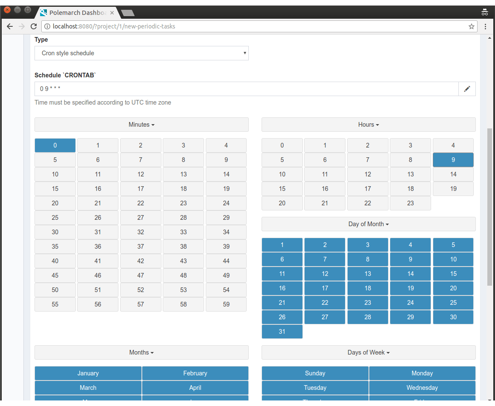

As you can see this task will be executed at 9 o'clock each day of each month.

Search
------
Almost everywhere in Polemarch you can filter your data. Let see for example
how to filter your execution history records to find result of needed action:

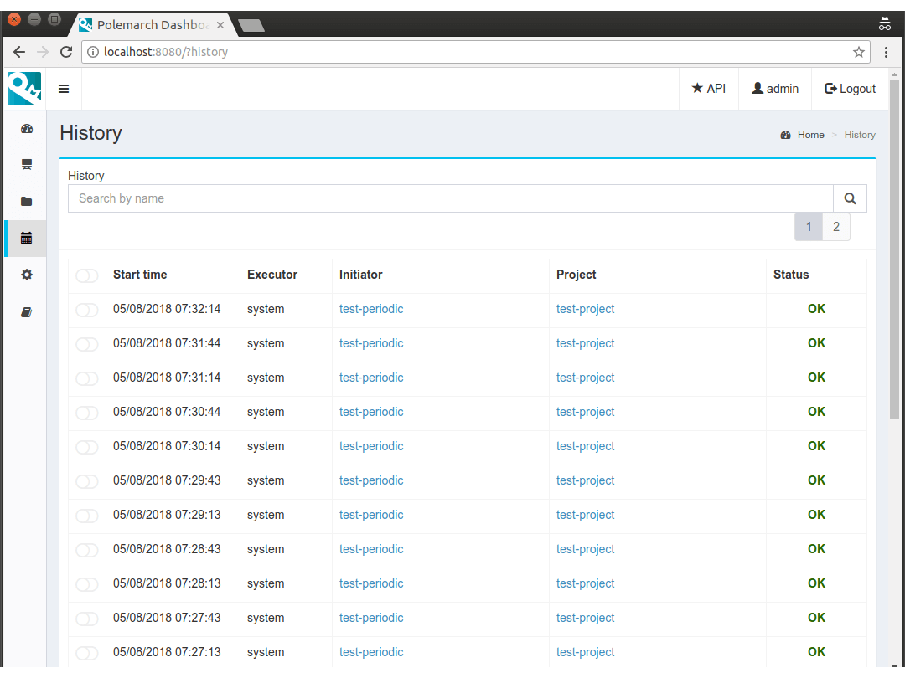

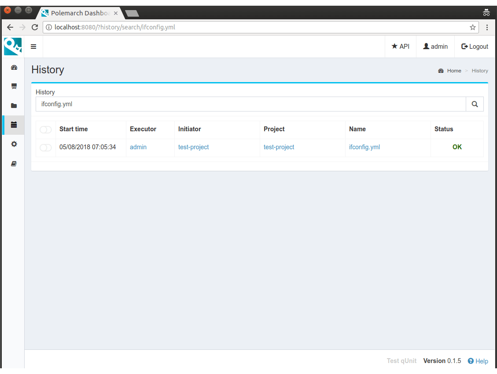