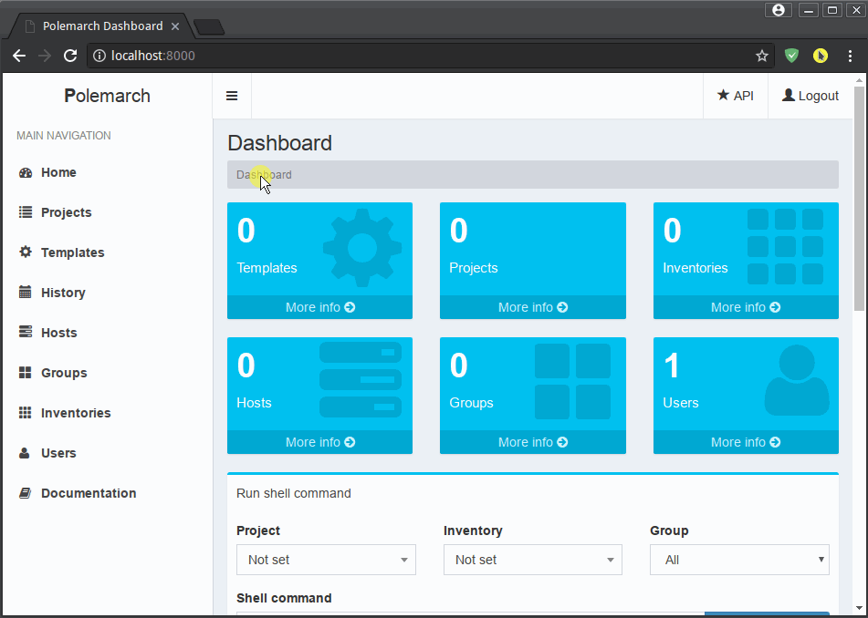
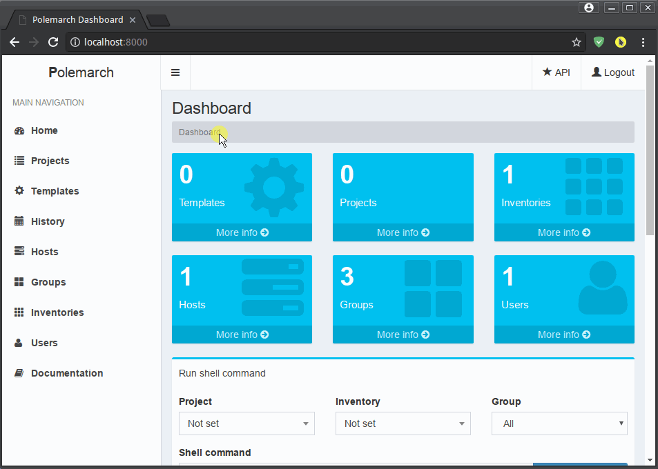
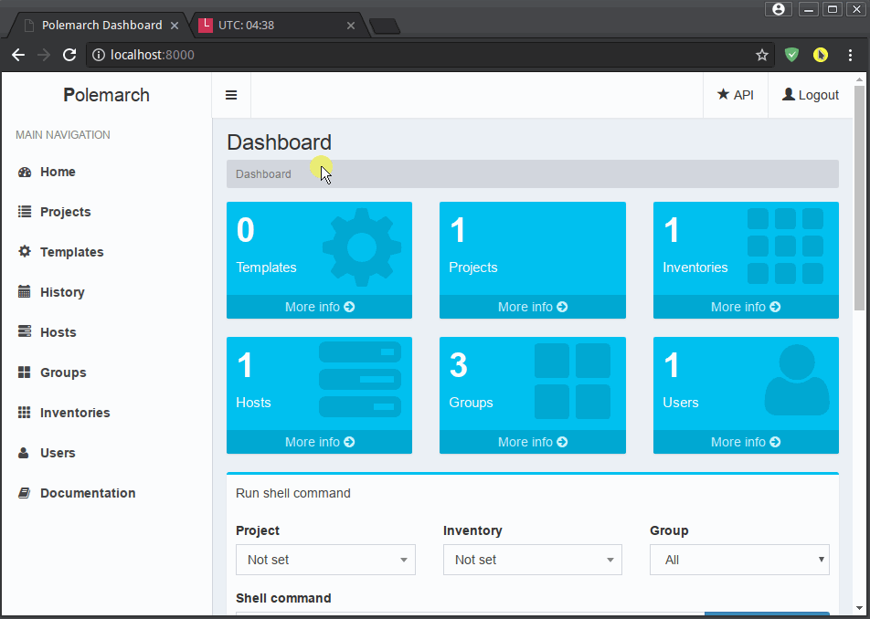
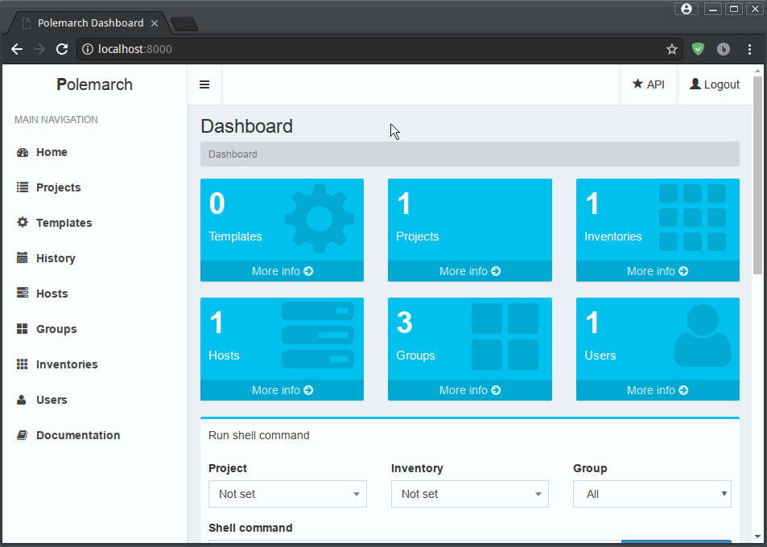
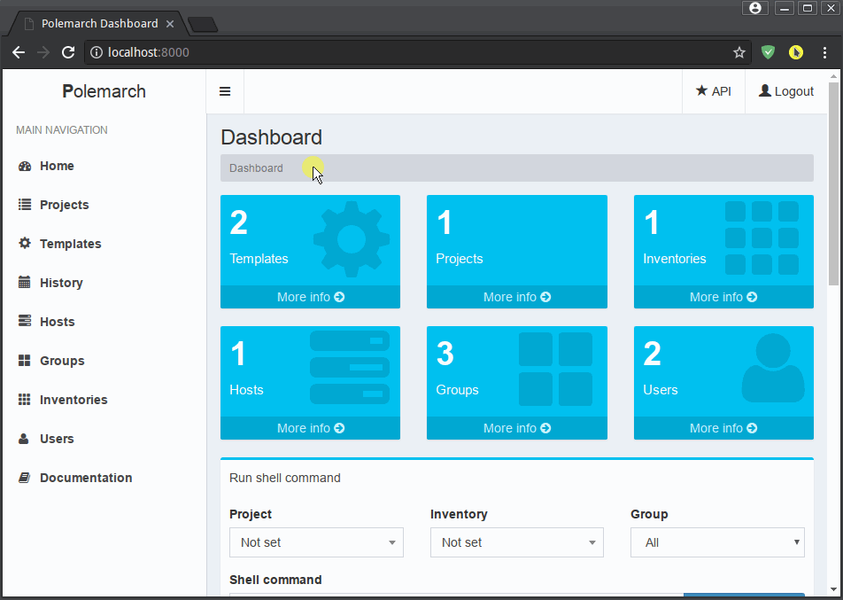
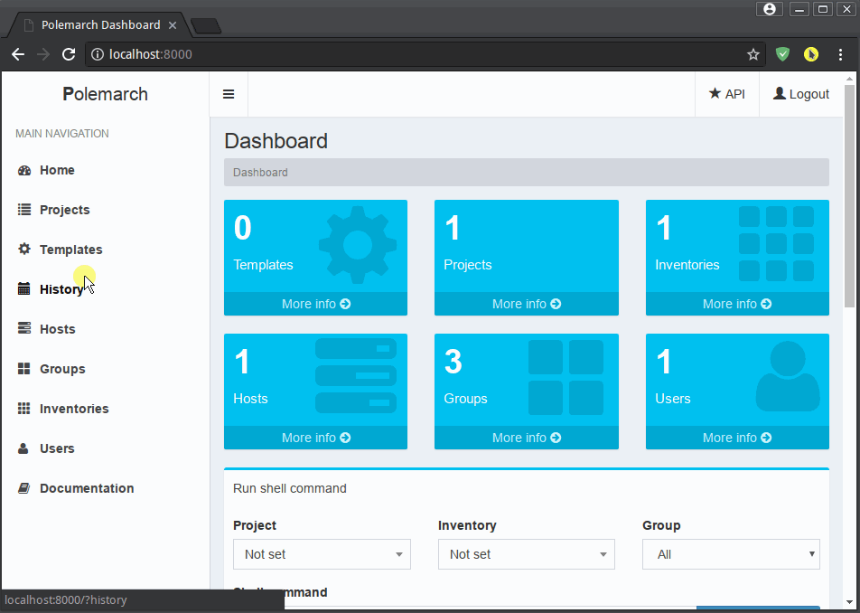

GUI workflow
==============

Before you start
----------------

Before you can do any job with Polemarch you should create at least one
inventory with your servers enumeration and at least one project, because all
Polemarch's functions are linked to the project.

Here how you can create inventory and place your hosts and groups there:

Also you can import Ansible inventory file:

Create project. Be aware that your project must have "OK" status, because your
playbooks won't work until Polemarch done synchronization with repository.
If you made everything right, project playbooks will be shown in suggestions
in playbook execution page.

If you don't have git repository, you can upload tar archive with project files
from any http url.

Also there is special type of project - empty project (MANUAL). In case you
want run only modules without any playbooks or something. Polemarch will
create folder for your project files in `projects_dir` (you can specify
in settings) named as project id (you can see at URL), where you manually
place your project files (like playbooks or something).

Polemarch will scan project dir root for any .yml file and provide possibility
to run them. So place available playbook targets at root of your Git repository
or tar-archive or folder with your project files.

If you update something in your git repository, don't forget to run sync in
Polemarch for pulling your changes.

Also maybe you want create separate user for yourself and some other members of
your team:

Execution of playbook and modules
---------------------------------

Ok, we made all preparations and ready to do some real work. Let's start by
executing some command on your servers:

Of course you can run any Ansible modules and any of playbooks in your project.
Also you can cancel your tasks if you want:

Almost everywhere in Polemarch you can filter your data. Let see for example
how filter your execution history records to find result of needed action:

Templates
---------

If you have many arguments, which you pass to Ansible at every task run (like
extra-vars, forks number ans so on), you can create template for such action
to minimize hand work (either module run or playbook):

Also you can backup/share your templates using import/export mechanism:

Periodic tasks
--------------

If you want to run some actions to run by schedule without any control from
you, it possible with Polemarch. You can create periodic tasks, which runs
every X seconds (interval based). You can even check those tasks using
"Run now" command:

Also you can create periodic tasks with more advancing scheduling options
(days of week, hours, month and so on) by using cron-style periodic tasks:

