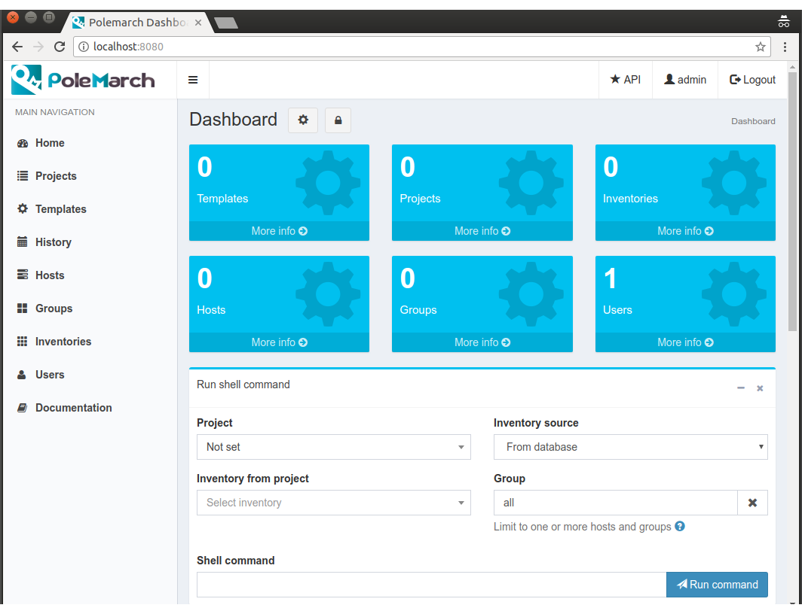
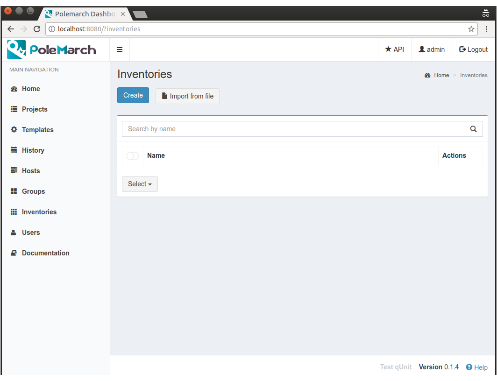
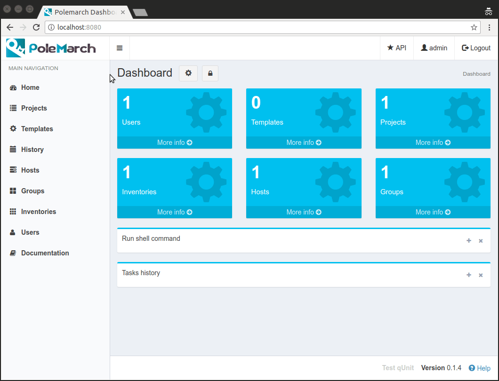
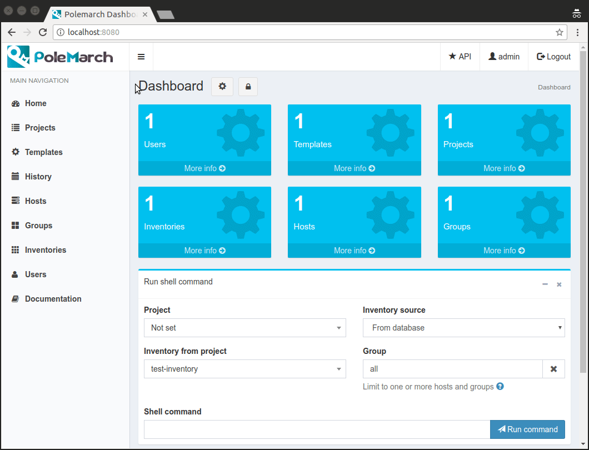

GUI workflow
==============

Welcome to Polemarch GUI
------------------------

In this section of our documentation we will tell you about Polemarch GUI's opportunities.

Let's begin with Dashboard page:

As you can see, Polemarch GUI provides user with 2 menus:

* the first one is located in the left sidebar and it is aimed
  to provide user with navigation between main system objects, like projects, templates, history records and ect.

* the second one is located in the top right conner of browser window and it is aimed
  to navigate user to API section, to user's page and to logout page.

Also there are some widgets on content block of Dashboard page. User can customize Dashboard page as he wish.
For example, user can change widgets' position, hide some widgets or collapse them.

To change widgets' position user should click on 'lock' button. After this button has been clicked,
user is able to change widgets' position by Drag and Drop.

To collapse or to hide/show some widgets user should click on 'cogwheel' button. After this button has been clicked,
Polemarch opens modal window, where user can activate or collapse some widgets.

To see all these features in work look at next gif-image:

Before you start
----------------

Before you can do any job with Polemarch you should create at least one
inventory with your servers enumeration and at least one project, because all
Polemarch's functions are linked to the project.

Let's start with creation of inventory:

There are 2 ways of inventory's creation:

* the first one is to create inventory manually. To do it user should click on 'Create' button.

* the second on is to import inventory from text file. To do it user should click on 'Import from file' button.

By inventory's creation, in this case, we understand creation of inventory, which includes at least one group,
which, in it's turn, includes at least one host. In other words, beside inventory user should create host and group.

To understand it better let's look at next gif-images:

Here you can see how user can create inventory and place his hosts and groups there manually:

.. image:: gui_gif1/new-create_inventory_manually.gif

And here you can see how user can import Ansible inventory file:

Futher to start your work with Polemarch you should create project.

There are 3 project types in Polemarch:

* GIT - Polemarch can sync with your git project.

* TAR - If you don't have git repository, you can upload tar archive with project files
  from any http url.

* MANUAL - Empty project. This kind of project will be appropriate for you,
  if you want run only modules without any playbooks or something. Polemarch will
  create folder for your project files in `projects_dir` (you can specify it
  in settings) named as project id (you can see at URL), where you
  place manually your project files (like playbooks or something).

Let's look at the example of GIT project's creation:

As you can see at the gif-image above for GIT project
it is possible to choose a branch to what user want to sync. In this example user has synced
his GIT project from 'master' branch to 'other' branch. 'Arrow' icon in the branch input field
shows us, that project will be sync from one branch to another. If there is no 'arrow' icon, it means,
that next time project will be sync to the same branch as you can see it in 'Branch' input field.

If you update something in your GIT repository, don't forget to run sync in
Polemarch for pulling your changes.

After your project's status has changed into "OK" you can confidently start working with Polemarch.

Execution of playbook and modules
---------------------------------

Ok, we made all preparations and ready to do some real work. Let's start by
executing some command on your servers:

As you can see at the gif-image above
when task has stopped running it become possible to clear ansible stdout.

Also you can run any Ansible modules and any of playbooks in your project.

Polemarch will scan project dir root for any .yml file and provide possibility
to run them. So place available playbook targets at root of your Git repository
or tar-archive or folder with your project files.

Be aware that your project must have "OK" status, because your
playbooks won't work until Polemarch done synchronization with repository.
If you made everything right, project playbooks will be shown in suggestions
in playbook execution page.

Let's look at the example of running some playbook, which Polemarch imported from GIT repository
of our project:

Templates
---------

If you have many arguments, which you pass to Ansible at every task run (like
extra-vars, forks number and so on), you can create template for such action
to minimize hand work (either module run or playbook):

Sometimes your need to keep some similar templates, which are different by only several parameters.
In this case template options will be extremly useful for you. In every template you can create
a lot of options which can modify this template by some parameters. Let's look at the example:

Also you can backup/share your templates using import/export mechanism:

Periodic tasks
--------------

If you want to run some actions by schedule without any control from
you, it is possible with Polemarch. You can create periodic tasks, which runs
every X seconds (interval based):

Also you can create periodic tasks with more advancing scheduling options
(days of week, hours, month and so on) by using cron-style periodic tasks:

Search
------
Almost everywhere in Polemarch you can filter your data. Let see for example
how to filter your execution history records to find result of needed action:

.. image:: gui_gif1/new-search2.gif